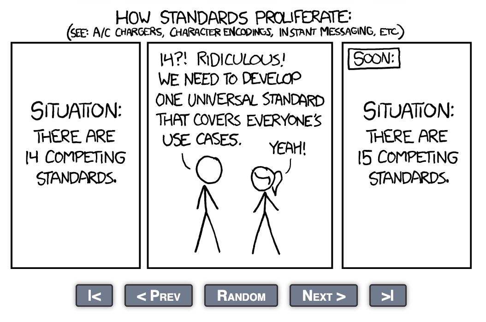

# Application Dependencies Research
This is a research contribution to the [Initiative: Specification for declaring application integration dependencies #1797](https://github.com/cncf/toc/issues/1797), which is focused upon the following:

> Create a project-agnostic specification that for declaring a service's dependencies, so that it could indicate to an application deployment team what other services must be readily available for the application to run successfully - e.g. APIs, databases, caches, blob stores, message buses, etc. 

> This is not meant to replace conversations between application engineers and production support. Rather, it's meant to give them a standardized reference that they can use to enable their discussion.

> The benefit of a spec is that it could also be leveraged for other use cases, such as guaranteeing abstraction coverage in Dapr, or for integration mocking in Microcks. Furthermore, it can support security efforts that are focused on expected application behavior, such as Software Bill of Behavior (SBOB) initiatives.

## Specifications
Alongside [complementary work I am doing on interface dependencies](https://github.com/naftiko/interfaces) I wanted to evaluate the five top specifications this group initiative is focusing on, resulting in my profiling the operations, schema, and dependencies for each.

- [Cloud Native Application Bundle](cloud-native-application-bundle.md)
- [Open Component Model](open-component-model.md)
- [Open Resource Discovery](open-resource-discovery.md)
- [Radius](radius.md)
- [Score](score.md)

My goal as an outsider was to get my head wrapped around how each of these specifications work, and what the operations, governance, and other aspects of the schema and tooling around them operate, to understand the overlap and differences in how they address dependencies.

## Process
I know nothing about any of these specifications, but have a lot of experience with "applications", as it pertains to their interfaces, so I tackled this research in the following ways:

- **JSON Schema** - I pulled the JSON Schema across all specifications to get the core properties of each.
- **Specification Priorities** - I summarized what the priorities were when it comes to each specification's properties.
- **Operational Priorities** - I summarized what the priorities were when it came to the operations behind each specification.
- **Examples** - I generated examples of each of the specifications using the JSON Schema and Claude to produce.
- **Mock APIs** - I generated OpenAPI using the JSON Schema and the Example, so I could play with each using Microcks.
- **APIs.json Index** - I produced an index for each specification that provides machine-readable overview of each spec.
- **Dependencies** - I evaluated the approach of each spec in regards to dependencies and then [generated a comparison](dependencies-comparison.md).
- **Recommendations** - I summarize my recommendations regarding what I think should occur based upon initiative goals.

I will continue to iterate on this work as it is relevant to the interface specifications I am working on, and how we are approaching the defining of business capabilities, but will share my findings within this moment.

## Summary
Across these five specifications I have aggregated the operational and specification specific properties to better understand the common and overlapping aspects of what these specifications do and how they are managed.

### Specification Priorities
These are priorities aggregated across the specifications, identifying the important parts they share within the specifications themselves.

> Annotations, APIs, Arguments, Bases, Bundles, Callbacks, Commands, Components, Configurations, Containers, Content, Context, Credentials, Custom, Data, Defaults, Definitions, Dependencies, Descriptions, Destinations, Digests, Directions, Encodings, Environments, Extensions, File systems, Formats, Generics, Groups, Headers, Hosts, Identifiers, Identities, Images, Inputs, Instances, Keys, Labels, Mappings, Maximums, Media, Metadata, Minimums, Multiples, Namespaces, Outputs, Parameters, Paths, Policies, Ports, Probes, Properties, Protocols, Providers, Readiness, Reads, References, References, Relations, Requests, Resources, Results, Runtimes, Schemes, Schemas, Selectors, Services, Sizes, Sources, Specifications, Statuses, Systems, Tags, Targets, Titles, Types, Updates, Variables, Versions, Volumes

This provides a top-level vocabulary that could be further used to begin working schema, mapping objects and properties, as well as helping inform a new schema work, and other areas alongside dependencies that are worth syncing.

### Operational Priorities
These are the operational properties aggregated across all of the specifications, helping understand what is available in aggregate and may be helping drive adoption, or may also contribute to a lack of adoption when missing.

> Adopters, API, Blog, Change Log, CLI, CNCF Project, Code of Conduct, Community, Community Meetings, Concepts, Contributing, Contributing Using Gen AI, Default Version, Dev Version, Discord, Documentation, Ecosystem, Emails, Examples, Extensions, FAQ, Getting Started, GitHub Organization, GitHub Repository, Governance, Guides, Help, Implementations, JSON Schema, License, Linting, Logos, Mailing List, Meeting Notes, OpenAPI, Platform Engineering, Policy Levels, Press, Recipes, Registries, Road Map, Samples, Schema, Security, Slack Channel, Specification, Steering Committee, Threads, Tools, Trademark, Tutorials, Use Cases, Videos, VSCode, Website, YouTube

This provides a common vocabulary to describe how these projects are operating and investing in their communities, which can be more evenly applied across the specifications as well as any new ones created to augment.

## Recommendations
These are my current recommendations for the initiative based upon my brief look at the specifications, their ecosystem, and the overlap across them, which includes an acknowledgement that we all indeed live in an XKCD cartoon.

- **Specification** - Create a new specification focused on application dependencies, which can be expressed as JSON or YAML.
- **ABNF Grammar** - Create an [Augmented Backus-Naur Form (ABNF)](https://datatracker.ietf.org/doc/html/rfc5234) grammar to map new spec properties to existing spec properties.
- **Converter** - Produce a converter for the ABNF grammar across the specifications, which can be used by any other tooling.
- **Reference** - Publish documentation for specification and examples of as many types of dependencies as possible.
- **Sandbox** - Provide OpenAPI, JSON Schema, and Microcks examples for reference architecture for application dependency sandbox.
- **Services** - Provide a catalog of all the top services that are provided in reference architecture and sandbox.
- **Tooling** - Provide a catalog of all the top tooling that are provided in reference architecture and sandbox.
- **Experience** - Provide a developer experience that reflects the top operational priorities across the existing specifications.
- **Governance** - Provide a set of Spectral or Vacuum rules that will govern all of the specifications for completeness.

I will be continuing this work with an emphasis on the [interface specifications](https://github.com/naftiko/interfaces) I am studying, but would be happy to continue providing feedback, and also would consider contributing to the specification in the areas of ABNF and Sandbox, with guidance on the other areas.

[Naftiko](https://naftiko.io) would be interested in contributing work when it comes to the available services and tooling, and help coordinate research and conversations to understand what different companies are using to help further contribute to a reference implementation and open-source sandbox implementations of those references.

## Support
If you have any questions or have any comments please submit an issue or email kinlane@naftiko.io, and I am happy to answer any questions or point you to other resources.

